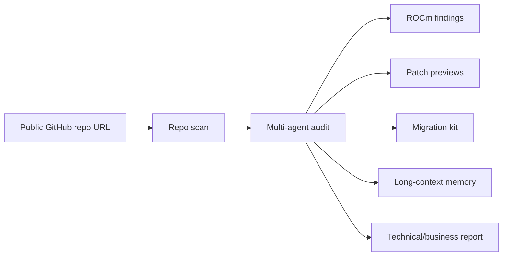
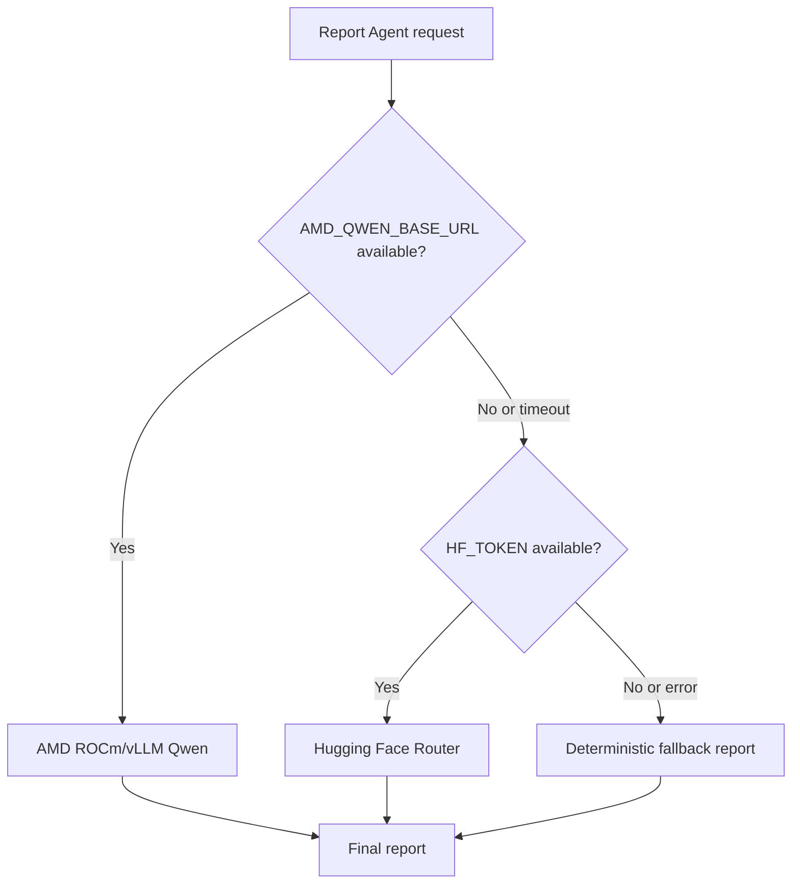
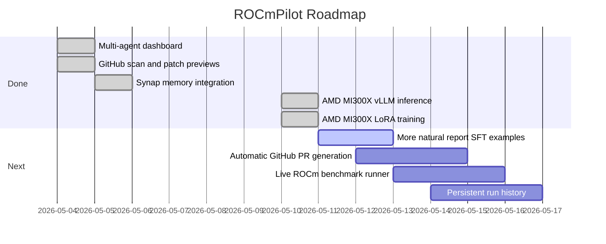

# ROCmPilot


**ROCmPilot** is a multi-agent developer platform that scans CUDA/NVIDIA-first AI repositories and generates an AMD ROCm migration plan: findings, patch previews, validation commands, benchmark proof boundaries, downloadable migration kits, long-context memory, and a final technical/business report.

> From "will this run on AMD?" to "here are the blockers, patch plan, validation path, and proof report."

ROCmPilot was built for the **AMD Developer Hackathon, Track 1: AI Agents & Agentic Workflows**. The MVP is a real deployed product with a reliability-first model path:

1. AMD MI300X + ROCm/vLLM Qwen endpoint when the droplet is online
2. Hugging Face Router fallback when AMD is offline
3. deterministic static fallback so the demo still completes

Read the full illustrated build story in the **[Technical Walkthrough](./TECHNICAL_WALKTHROUGH.md)**.

## Live Links

| Artifact | Link |
| --- | --- |
| Live Vercel app | [https://rocmpilot.vercel.app](https://rocmpilot.vercel.app) |
| Source code | [https://github.com/shivambhartiya/rocmpilot](https://github.com/shivambhartiya/rocmpilot) |
| Hugging Face Space | [https://shivam311-rocmpilot.hf.space](https://shivam311-rocmpilot.hf.space) |
| Training dataset | [Shivam311/rocmpilot-agent-sft](https://huggingface.co/datasets/Shivam311/rocmpilot-agent-sft) |
| AMD-trained LoRA adapter | [Shivam311/rocmpilot-agent-qwen25-coder-7b-lora-amd-mi300x-v1](https://huggingface.co/Shivam311/rocmpilot-agent-qwen25-coder-7b-lora-amd-mi300x-v1) |
| Technical walkthrough | [TECHNICAL_WALKTHROUGH.md](./TECHNICAL_WALKTHROUGH.md) |

## The Problem

AI teams want GPU choice, but many AI repositories quietly assume NVIDIA at every layer:

- `nvidia/cuda` or `nvcr.io/nvidia/pytorch` Docker images
- `torch.device("cuda")`, `.cuda()`, and `device_map="cuda"`
- CUDA wheel pins such as `cu121`, `cu124`, `nvidia-cublas-cu12`, or `nvidia-cudnn-cu12`
- `nvidia-smi`, `CUDA_VISIBLE_DEVICES`, `--gpus all`, and `runtime: nvidia`
- vLLM launch scripts without ROCm/MI300X serving knobs
- benchmark claims without backend, memory, p95 latency, tokens/sec, model id, or command provenance

That makes AMD adoption harder than it should be. Developers do not only need documentation. They need an audit, a migration plan, a validation path, and a report that separates real proof from guesses.

## The Idea

ROCmPilot turns CUDA-to-ROCm migration into a coordinated agent workflow.



The result is not a vague chatbot answer. It is a structured migration package that a developer, maintainer, or infrastructure lead can act on.

## What The MVP Does

- Accepts curated sample workloads or a **public GitHub repository URL**
- Validates whether the GitHub repo exists and is public
- Scans Dockerfiles, Python files, shell scripts, requirements, YAML, and benchmark files
- Detects CUDA/NVIDIA assumptions and missing AMD validation evidence
- Shows a live multi-agent timeline
- Shows an **Agent War Room** where agents ask each other questions, challenge assumptions, and record decisions
- Generates ROCm-focused patch previews
- Generates terminal-style migration logs
- Shows an AMD-readiness benchmark profile with clear proof boundaries
- Provides a **CUDA/ROCm Coach Agent** for developer questions
- Provides a **Migration Kit Agent** that creates downloadable migration guidance
- Stores and recalls long-context memory through Maximem Synap when configured
- Generates a final markdown report through AMD, Hugging Face, or static fallback

## Agent Fleet

| Agent | Job | Why It Matters |
| --- | --- | --- |
| Repo Doctor Agent | Finds CUDA/NVIDIA assumptions across repo files. | Gives the audit a concrete evidence base. |
| Migration Planner Agent | Converts findings into ROCm-safe recommendations. | Avoids destructive rewrites and keeps CUDA optional. |
| Build Runner Agent | Designs build, smoke test, and validation commands. | Turns advice into testable engineering work. |
| Benchmark Agent | Separates estimates from live measurements. | Prevents fake performance claims. |
| Memory Agent | Stores reusable migration lessons. | Makes future runs smarter. |
| Report Agent | Writes the final technical/business report. | Gives judges and stakeholders a clean story. |
| CUDA/ROCm Coach Agent | Answers user questions about CUDA, ROCm, PyTorch, vLLM, and AMD proof. | Makes the tool useful during migration. |
| Migration Kit Agent | Creates a downloadable migration kit from findings and patch previews. | Gives teams a handoff artifact. |

## Agent War Room

Each task has a lead agent, but the lead does not work alone.

Example:

```text
Repo Doctor -> Build Runner:
This Dockerfile uses nvidia/cuda and the launch path depends on --gpus all.
Which part blocks AMD validation first?

Build Runner -> Repo Doctor:
Container startup is the first blocker. Add a ROCm profile and prove rocm-smi,
torch.version.hip, and the vLLM health endpoint before claiming readiness.

Memory Agent:
Store that CUDA support should remain as a separate backend while ROCm gets its own profile.
```

This is the core Track 1 story: ROCmPilot is a multi-agent workflow, not just a prompt wrapper.

## Long-Context Memory

ROCmPilot integrates **Maximem Synap** for persistent agent memory.

When Synap is configured, the Report Agent stores the run transcript as an `ai-chat-conversation`, fetches relevant previous context, and injects it into report generation.

If Synap is unavailable, the app falls back to reconstructed local memory and marks the UI honestly.

Examples of stored memory:

- keep CUDA support as an optional backend instead of deleting it
- label benchmark estimates until live AMD logs exist
- use `rocm-smi` or `amd-smi` for AMD proof instead of `nvidia-smi`
- centralize device resolution instead of scattering `.cuda()` changes
- record vLLM startup logs before making AMD model-serving claims

## AMD Proof

ROCmPilot now has real AMD infrastructure proof.

### 1. AMD MI300X Inference

We started an AMD Developer Cloud MI300X droplet with the ROCm/vLLM quick-start image and served Qwen through an OpenAI-compatible vLLM endpoint.

Production model path while AMD is online:

```text
AMD MI300X -> ROCm -> vLLM -> Qwen/Qwen2.5-Coder-7B-Instruct -> ROCmPilot Report Agent
```

The deployed Vercel app successfully returned:

```text
source: amd-vllm
label: AMD GPU Model: Connected
model: Qwen/Qwen2.5-Coder-7B-Instruct
```

### 2. AMD MI300X Training

We also trained a Qwen Coder LoRA adapter directly on AMD MI300X/ROCm.

| Item | Value |
| --- | --- |
| Base model | `Qwen/Qwen2.5-Coder-7B-Instruct` |
| Output adapter | `Shivam311/rocmpilot-agent-qwen25-coder-7b-lora-amd-mi300x-v1` |
| Dataset | `Shivam311/rocmpilot-agent-sft` |
| Dataset size | 297 examples |
| Hardware | AMD MI300X |
| Runtime | ROCm PyTorch |
| LoRA | `r=32`, `alpha=64`, `dropout=0.05` |
| Runtime | about 279 seconds |
| Train loss | about 0.497 |
| Final eval loss | about 0.0447 |
| Adapter size | about 323 MB |

The adapter was loaded into vLLM as:

```text
model=rocmpilot
```

Direct inference against `model=rocmpilot` succeeded on the AMD endpoint. For the public report panel, the production app currently uses the base AMD-hosted Qwen model because the adapter is optimized for structured agent behavior and tends to emit schema-like completions. The next dataset iteration will add more natural markdown report examples before switching the production report panel to the adapter.

## Reliability Architecture

The app is designed to survive live-demo chaos.



If the AMD droplet is shut down, ROCmPilot automatically tries Hugging Face. If Hugging Face also fails, the demo still completes with the static fallback.

## Tech Stack

| Layer | Technology |
| --- | --- |
| Frontend | Next.js App Router, TypeScript, Tailwind CSS, shadcn/ui |
| AI UI | AI Elements for markdown, code blocks, and terminal rendering |
| Backend | Vercel serverless API routes |
| Repo scan | GitHub API |
| Agent memory | Maximem Synap with local fallback |
| AMD inference | AMD MI300X, ROCm, vLLM, Qwen |
| AMD training | ROCm PyTorch, PEFT/LoRA, Qwen2.5-Coder 7B |
| Fallback model layer | Hugging Face Router |
| Dataset/model hosting | Hugging Face Hub |
| Deployment | Vercel and Hugging Face Spaces |

## Local Development

```bash
npm install
npm run dev
```

Open:

```text
http://localhost:3000
```

Run checks:

```bash
npm run lint
npm run build
```

Optional Synap runtime setup:

```bash
npm run synap:setup
```

The Synap JS SDK uses a Python bridge. If it cannot initialize in a serverless runtime, ROCmPilot falls back safely.

## Environment Variables

Hugging Face fallback:

```bash
HF_TOKEN=your_hugging_face_token
HF_REPORT_MODEL=Qwen/Qwen2.5-Coder-7B-Instruct
```

GitHub API rate-limit support:

```bash
GITHUB_TOKEN=your_github_token
```

Synap memory:

```bash
SYNAP_API_KEY=your_synap_api_key
SYNAP_INSTANCE_ID=your_synap_instance_id
SYNAP_BASE_URL=https://synap-cloud-prod.maximem.ai
SYNAP_CUSTOMER_ID=rocmpilot-hackathon
SYNAP_USER_ID=rocmpilot-agent-fleet
```

AMD ROCm/vLLM:

```bash
AMD_QWEN_BASE_URL=http://YOUR_AMD_INSTANCE:8000
AMD_QWEN_MODEL=Qwen/Qwen2.5-Coder-7B-Instruct
AMD_QWEN_API_KEY=your_vllm_api_key
```

Optional trained adapter serving:

```bash
AMD_QWEN_MODEL=rocmpilot
```

Only use `rocmpilot` in production once the report-style dataset has enough natural markdown completions.

## Deploy On Vercel

```bash
npx vercel
```

Set the environment variables in Vercel Project Settings. The app does not need a database for the MVP because the run ID encodes the stateless run target and start time.

## Deploy As A Hugging Face Space

This repo includes a Docker Space setup:

- `Dockerfile`
- `.dockerignore`
- Hugging Face Space metadata in this README frontmatter

The app listens on port `7860` in the Space container.

Recommended Space:

```text
Shivam311/rocmpilot
```

## Training

The `agent-training/` folder contains the training pipeline.

| File | Purpose |
| --- | --- |
| `seed-examples.jsonl` | source examples for ROCmPilot agent behavior |
| `rocmpilot-sft-preview.jsonl` | chat-formatted SFT preview |
| `dataset-card.md` | Hugging Face dataset card |
| `eval-rubric.md` | qualitative evaluation rubric |
| `runs.md` | training run log |
| `scripts/generate_seed_examples.py` | expands synthetic migration examples |
| `scripts/prepare_dataset.py` | converts examples to chat SFT format |
| `scripts/train_rocmpilot_sft.py` | LoRA SFT script for HF Jobs or AMD |
| `scripts/evaluate_agent.py` | smoke eval against OpenAI-compatible endpoints |

Regenerate data:

```bash
python agent-training/scripts/generate_seed_examples.py
python agent-training/scripts/prepare_dataset.py
```

Push the dataset:

```bash
python agent-training/scripts/prepare_dataset.py \
  --push \
  --repo-id Shivam311/rocmpilot-agent-sft
```

The current dataset has **297 examples** across:

- repo scanning
- migration planning
- patch planning
- benchmark proof boundaries
- report writing
- long-context memory
- endpoint troubleshooting
- CUDA/ROCm coaching
- migration kit generation
- agent-to-agent discussions

## Real vs Demo Boundaries

| Capability | Status |
| --- | --- |
| Dashboard and repo intake | Implemented |
| Public GitHub scanning | Implemented |
| CUDA/NVIDIA findings | Implemented |
| Patch previews | Implemented |
| Downloadable migration kit | Implemented |
| CUDA/ROCm Coach Agent | Implemented |
| Agent War Room | Implemented |
| Synap memory integration | Implemented with fallback |
| AMD MI300X inference | Implemented and verified |
| AMD MI300X LoRA training | Implemented and verified |
| Hugging Face fallback | Implemented |
| Static fallback | Implemented |
| Automatic PR creation | Not implemented yet |
| Real external repo mutation | Not performed by design in the MVP |
| Live workload benchmark execution | Planned next |

## Business Value

ROCmPilot is useful for:

- AI startups evaluating AMD GPU optionality
- infrastructure teams migrating CUDA services
- open-source maintainers adding ROCm support
- enterprises that need proof before changing GPU providers
- cloud and GPU platform teams that need repeatable readiness reports

Business impact:

- reduces manual audit time
- lowers migration risk
- makes AMD adoption easier
- creates a reviewable handoff artifact
- prevents unsupported benchmark claims
- turns migration knowledge into reusable organizational memory

## Roadmap



## Submission Positioning

ROCmPilot fits **Track 1: AI Agents & Agentic Workflows** because the core product is agent coordination: scanning, planning, validating, benchmarking, remembering, explaining, and producing an actionable report.

The AMD story is real:

- AMD MI300X inference through ROCm/vLLM
- AMD MI300X LoRA training with Qwen Coder
- Qwen model and adapter hosted through a production-style OpenAI-compatible serving path
- fallback architecture that keeps the product reliable

Clean pitch:

> ROCmPilot helps developers migrate AI workloads to AMD faster. It scans a GitHub repo, finds CUDA assumptions, proposes ROCm patches, prepares AMD validation, stores reusable migration memory, and generates a business-ready migration report powered by Qwen on AMD when available.

## Sources

- AMD: Day 0 Support for Qwen3-Coder-Next on AMD Instinct GPUs  
  https://www.amd.com/en/developer/resources/technical-articles/2026/day-0-support-for-qwen3-coder-next-on-amd-instinct-gpus.html
- Qwen3-Coder announcement  
  https://qwenlm.github.io/blog/qwen3-coder/
- vLLM supported models  
  https://docs.vllm.ai/en/v0.15.1/models/supported_models/
- Hugging Face Docker Spaces  
  https://huggingface.co/docs/hub/spaces-sdks-docker
- Hugging Face Jobs  
  https://huggingface.co/docs/huggingface_hub/guides/jobs
