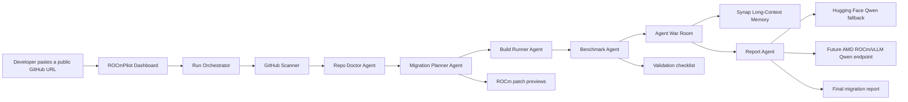
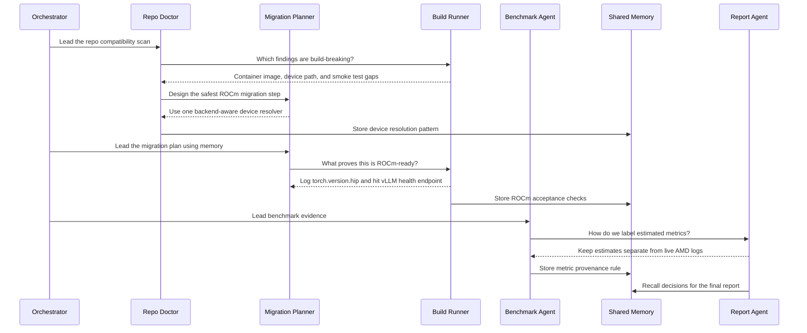
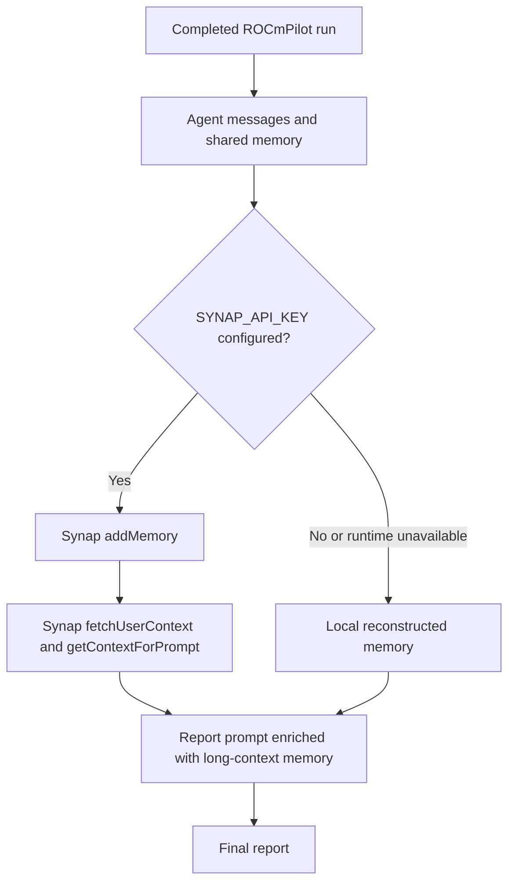
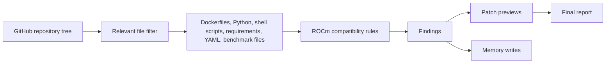
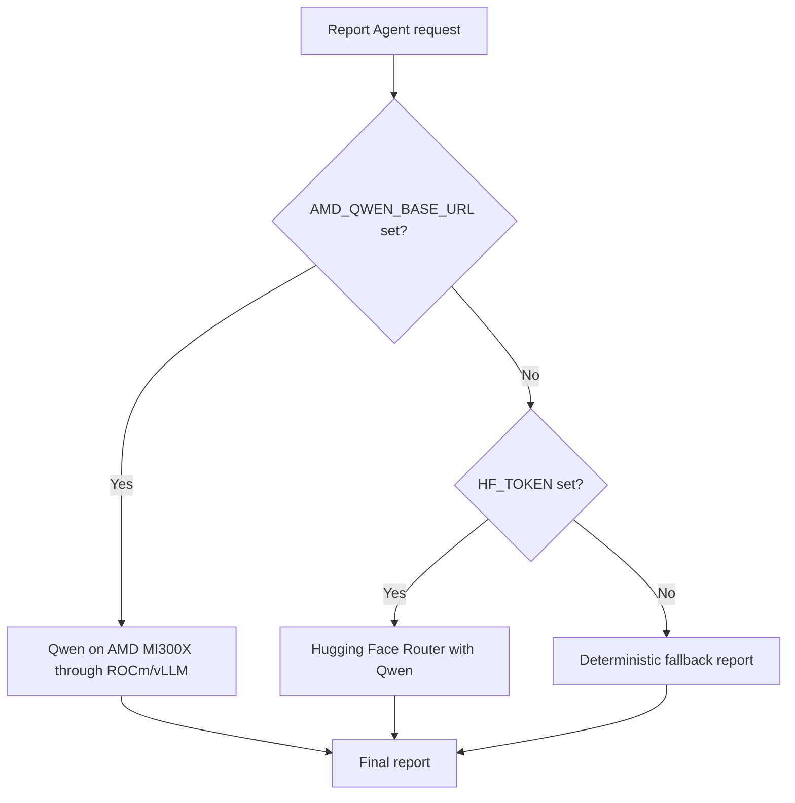
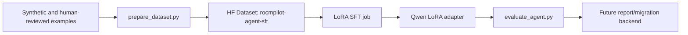
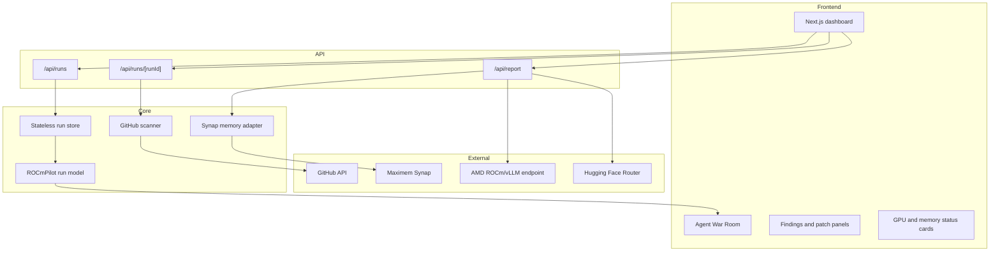
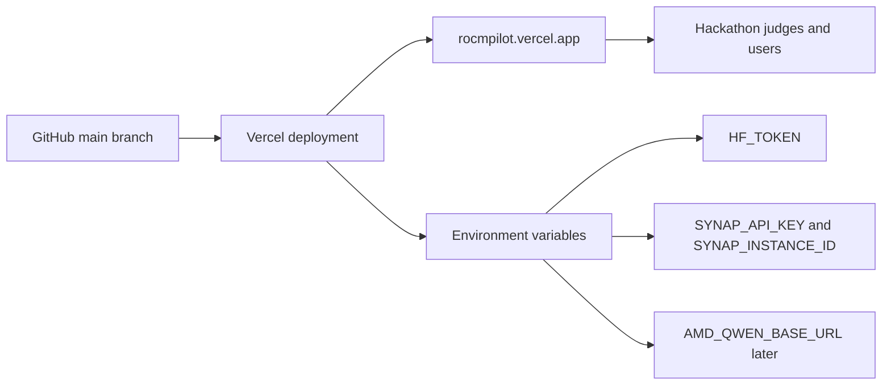
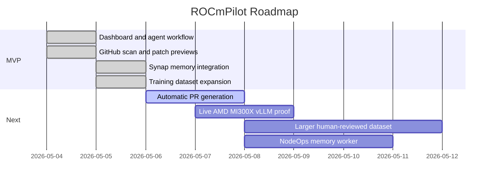

# ROCmPilot Technical Walkthrough


## Submission Links

| Artifact | Link |
| --- | --- |
| Live demo | [https://rocmpilot.vercel.app](https://rocmpilot.vercel.app) |
| Source code | [https://github.com/shivambhartiya/rocmpilot](https://github.com/shivambhartiya/rocmpilot) |
| Training dataset | [https://huggingface.co/datasets/Shivam311/rocmpilot-agent-sft](https://huggingface.co/datasets/Shivam311/rocmpilot-agent-sft) |
| Technical walkthrough | [TECHNICAL_WALKTHROUGH.md](./TECHNICAL_WALKTHROUGH.md) |

## One-Line Pitch

ROCmPilot is a multi-agent developer tool that scans CUDA-first AI repositories and generates ROCm migration findings, patch previews, validation plans, reusable memory, and a judge-ready technical/business report.

## Why ROCmPilot Matters

AI teams often want AMD GPU optionality, but real repositories quietly assume NVIDIA at many layers:

- Docker images such as `nvidia/cuda` or `nvcr.io/nvidia/pytorch`
- Python code with `torch.device("cuda")`, `.cuda()`, or `device_map="cuda"`
- dependency pins for `cu121`, `cu124`, `nvidia-cublas-cu12`, `flash-attn`, or `xformers`
- scripts using `nvidia-smi`, `CUDA_VISIBLE_DEVICES`, or `--gpus all`
- vLLM launch scripts that do not expose ROCm validation knobs
- benchmarks that report latency without backend, memory, tokens/sec, or command provenance

ROCmPilot converts that messy migration work into a structured agentic workflow. It does not pretend to automatically port every project. Instead, it gives developers a credible migration map, concrete patch previews, validation evidence, and a report they can hand to maintainers or infrastructure leaders.

## Product Overview



## User Flow

1. Open the ROCmPilot dashboard.
2. Select a sample workload or paste a public GitHub repository URL.
3. Start a run.
4. Watch the live agent timeline and Agent War Room.
5. Review findings, patch previews, logs, benchmark profile, and long-context memory status.
6. Read the generated final report.
7. Use the output as a migration plan or as the basis for a future PR.

## Agent System

ROCmPilot uses specialized agents, each responsible for a different migration concern.

| Agent | Responsibility | Output |
| --- | --- | --- |
| Repo Doctor Agent | Finds CUDA/NVIDIA assumptions across code, Docker, scripts, dependencies, and benchmarks. | Findings with severity, category, file, line, and fix. |
| Migration Planner Agent | Converts findings into ROCm-safe migration recommendations. | Patch previews and backend-aware migration steps. |
| Build Runner Agent | Challenges whether the plan can be validated. | Smoke-test commands, container checks, and proof boundaries. |
| Benchmark Agent | Separates live evidence from estimates. | AMD-readiness profile and measurement plan. |
| Memory Agent | Stores reusable decisions across runs. | Synap-backed long-context memory or local fallback memory. |
| Report Agent | Turns the run into a credible submission/report. | Final markdown report with technical and business value. |

## Agent War Room

The MVP is not just a set of isolated cards. Agents route messages to each other, ask questions, answer objections, and write shared memory.



## Long-Context Memory With Synap

ROCmPilot integrates Maximem Synap as the long-context memory layer. When configured, the Report Agent stores the whole agent discussion as an `ai-chat-conversation`, fetches relevant context, and injects it into report generation.

If Synap credentials or runtime setup are unavailable, ROCmPilot falls back to reconstructed local memory so the demo remains reliable.



### Memory Values Stored

| Memory Type | Example |
| --- | --- |
| Device resolution pattern | Use a single backend resolver instead of scattered `.cuda()` checks. |
| ROCm acceptance checks | Prove import, backend detection, vLLM health, and provenance logging. |
| Container split decision | Add `Dockerfile.rocm`; keep CUDA support separate. |
| Metric provenance rule | Label estimates until AMD SMI/vLLM logs exist. |
| Health-check rule | Replace `nvidia-smi` proof with `rocm-smi` or `amd-smi` proof on AMD. |

## Detection and Recommendation Logic

ROCmPilot scans public GitHub repositories using the GitHub API and focuses on files that usually control AI runtime portability.



### Current Detection Categories

| Category | Severity | Typical Evidence | Recommended Direction |
| --- | --- | --- | --- |
| Hardcoded CUDA device path | Critical | `.cuda()`, `torch.device("cuda")`, `device_map="cuda"` | Add a backend-aware resolver and log ROCm/CUDA/CPU provenance. |
| NVIDIA container/runtime assumption | High | `nvidia/cuda`, `nvcr.io`, `--gpus all` | Add ROCm runtime image/profile and keep CUDA optional. |
| CUDA-oriented dependency | High | `cu124`, `nvidia-cublas-cu12`, `flash-attn`, `xformers` | Split dependencies into backend-specific profiles. |
| vLLM defaults need AMD profile | Medium | vLLM launch without model length, tensor parallelism, or metrics | Add ROCm vLLM serve script with OpenAI-compatible endpoint settings. |
| Benchmark evidence incomplete | Medium | latency-only benchmark | Add tokens/sec, memory, backend, model id, command provenance, p95 latency. |
| NVIDIA monitoring command | Medium | `nvidia-smi` | Add `rocm-smi` or `amd-smi` evidence path. |
| CUDA extension build path | High | `.cu`, `CUDAExtension`, `CUDA_HOME` | Gate CUDA extension builds and document ROCm-safe alternatives. |
| Docker Compose NVIDIA reservation | High | `driver: nvidia`, `runtime: nvidia` | Add separate ROCm Compose profile. |

## Patch Preview Example

ROCmPilot does not currently mutate external repositories or open PRs automatically. Instead, it generates patch previews that are safe to review.

```diff
+import torch
+
+def resolve_device() -> tuple[str, str]:
+    if torch.cuda.is_available():
+        backend = "rocm" if getattr(torch.version, "hip", None) else "cuda"
+        return "cuda", backend
+    return "cpu", "cpu"
+
+DEVICE, GPU_BACKEND = resolve_device()
```

This pattern is important because PyTorch on ROCm still exposes GPU access through the `torch.cuda` API surface. The resolver records whether the backend is actually CUDA or HIP-backed ROCm.

## Model and Compute Strategy

ROCmPilot is a Track 1 agentic workflow project. The GPU plan is model serving, not fine-tuning as the main hackathon track.



### Backend Priority

1. AMD ROCm/vLLM endpoint via `AMD_QWEN_BASE_URL`
2. Hugging Face Router via `HF_TOKEN`
3. Static fallback report

This keeps the submission demo-safe while preserving the AMD compute story. Once AMD Developer Cloud access is available, the same report endpoint can prefer AMD-hosted Qwen automatically.

## Training Path on Hugging Face

The project includes a small supervised fine-tuning path for polishing the agent style and migration recommendations.

| Artifact | Detail |
| --- | --- |
| Dataset repo | [Shivam311/rocmpilot-agent-sft](https://huggingface.co/datasets/Shivam311/rocmpilot-agent-sft) |
| Current seed size | 95 examples |
| Tasks | migration planner, patch planner, benchmark agent, report agent, memory agent |
| Base model target | `Qwen/Qwen2.5-Coder-0.5B-Instruct` for small LoRA experiments |
| Output model target | `Shivam311/rocmpilot-agent-qwen-lora-v2` |



Training is supporting polish, not the central submission claim. The main project remains an agentic developer workflow.

## App Architecture



## Data Model


## Deployment Architecture



## Environment Variables

| Variable | Required for MVP | Purpose |
| --- | --- | --- |
| `HF_TOKEN` | Recommended | Enables Hugging Face Qwen report generation. |
| `HF_REPORT_MODEL` | Optional | Defaults to `Qwen/Qwen2.5-Coder-7B-Instruct`. |
| `GITHUB_TOKEN` | Optional | Raises GitHub API limits for public repo scans. |
| `SYNAP_INSTANCE_ID` | Optional | Targets the Synap memory instance. |
| `SYNAP_API_KEY` | Optional | Enables persistent long-context memory. |
| `SYNAP_BASE_URL` | Optional | Synap cloud endpoint override. |
| `SYNAP_CUSTOMER_ID` | Optional | Memory scope, defaults to `rocmpilot-hackathon`. |
| `SYNAP_USER_ID` | Optional | Agent fleet memory identity. |
| `AMD_QWEN_BASE_URL` | Later | Enables AMD-hosted Qwen through ROCm/vLLM. |
| `AMD_QWEN_MODEL` | Later | Defaults to `Qwen/Qwen3-Coder-Next`. |

## Demo Script

Use this script for a 2-3 minute project walkthrough.

1. Open [https://rocmpilot.vercel.app](https://rocmpilot.vercel.app).
2. Paste a CUDA-heavy public repo, for example `https://github.com/NVIDIA/cuda-samples` or `https://github.com/NVIDIA/Megatron-LM`.
3. Click `Scan Repo`.
4. Explain that Repo Doctor scans public files for CUDA/NVIDIA assumptions.
5. Point to the Agent War Room and show agents asking each other questions instead of acting independently.
6. Show Shared Memory and explain that decisions are reused later.
7. Open Migration Findings and Patch Previews.
8. Open the GPU model status card and explain the backend priority: AMD ROCm/vLLM when available, Hugging Face fallback now, static fallback for reliability.
9. Open the Long-context memory card and explain Synap memory.
10. Show the final report and emphasize business value: faster AMD migration planning, reduced infra risk, and a clear path from audit to validation.

## What Is Fully Implemented Today

| Capability | Status |
| --- | --- |
| Next.js dashboard | Implemented |
| Public GitHub URL scan | Implemented |
| CUDA/NVIDIA findings | Implemented |
| Patch previews | Implemented |
| Agent War Room routed messages | Implemented |
| Shared run memory | Implemented |
| Synap memory adapter | Implemented with fallback |
| Hugging Face Qwen report generation | Implemented when `HF_TOKEN` is configured |
| Static fallback report | Implemented |
| Vercel deployment | Implemented |
| Training dataset | Implemented and published |

## Honest Boundaries

| Capability | Current Boundary |
| --- | --- |
| Automatic PR creation | Not implemented yet. ROCmPilot generates patch previews and recommendations. |
| Live AMD MI300X benchmark proof | Pending AMD Developer Cloud access. Current benchmark cards are labeled static estimates. |
| Synap on every Vercel run | Integrated, but falls back if the Synap Python bridge cannot initialize in the serverless runtime. |
| Full repository mutation | Not performed by design in the MVP. Maintainers should review patch previews first. |

## Business Value

ROCmPilot is useful for:

- AI startups that want AMD GPU optionality without manually auditing every codebase.
- Infrastructure teams evaluating whether an internal CUDA-first service can move to ROCm.
- Open-source maintainers who want clear, reviewable migration guidance.
- Cloud/GPU providers that need a repeatable readiness assessment workflow.

### Business Impact

| Problem | ROCmPilot Value |
| --- | --- |
| Migration audits are manual and slow. | Automated agentic scan and report. |
| CUDA assumptions hide across many files. | Multi-layer detection across Docker, Python, shell, dependencies, and benchmarks. |
| Teams overclaim hardware readiness. | Explicit separation of estimates, fallback, and live AMD proof. |
| Migration work is hard to hand off. | Patch previews and judge/infra-ready report. |
| Agents forget past decisions. | Synap long-context memory for reusable migration knowledge. |

## Roadmap



## Future AMD Integration

When AMD Developer Cloud access is available:

1. Start an MI300X instance.
2. Launch Qwen through ROCm/vLLM using an OpenAI-compatible server.
3. Set `AMD_QWEN_BASE_URL` and `AMD_QWEN_MODEL` in Vercel.
4. Re-run ROCmPilot.
5. Capture proof:
   - AMD GPU visibility logs
   - vLLM startup logs
   - one successful model response
   - workload validation output
   - updated final report generated through AMD-hosted Qwen

Suggested command:

```bash
python -m vllm.entrypoints.openai.api_server \
  --model Qwen/Qwen3-Coder-Next \
  --host 0.0.0.0 \
  --port 8000 \
  --tensor-parallel-size 1 \
  --max-model-len 32768
```

## Why This Fits Track 1

ROCmPilot is not primarily a fine-tuning project and not primarily a multimodal project. It is a coordinated AI-agent workflow:

- multiple specialized agents
- routed agent-to-agent discussion
- lead-agent task ownership
- shared and persistent memory
- model-backed report generation
- real developer workflow around repository migration

That makes **AI Agents & Agentic Workflows** the best hackathon track.

## Closing Summary

ROCmPilot turns CUDA-to-ROCm migration from an unclear engineering chore into an agentic developer workflow. It scans real repositories, identifies migration blockers, proposes ROCm-ready patches, records reusable memory, and generates a technical/business report. The MVP is reliable on Vercel today through Hugging Face and fallback paths, while the architecture is ready to upgrade to AMD Instinct GPUs with ROCm/vLLM as soon as AMD cloud access is available.
