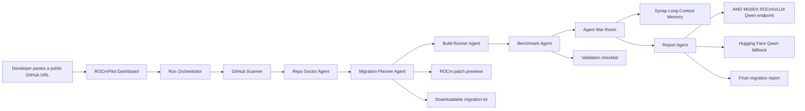
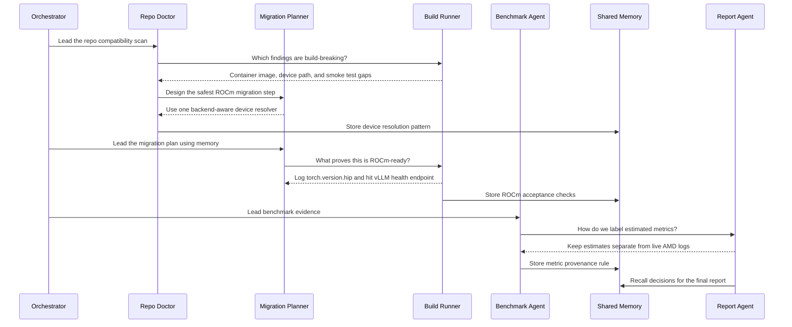
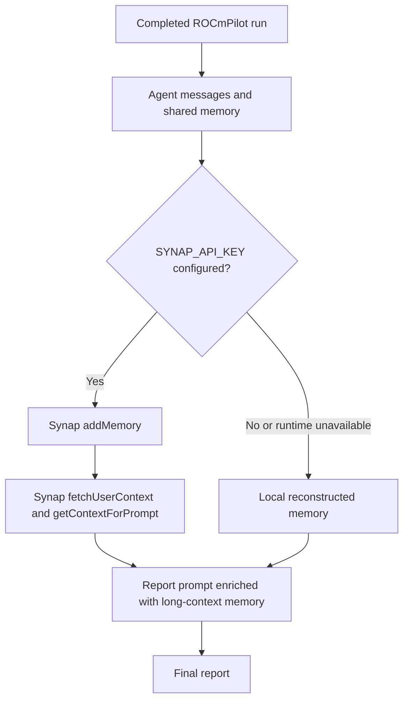
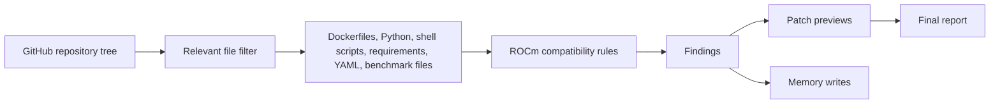
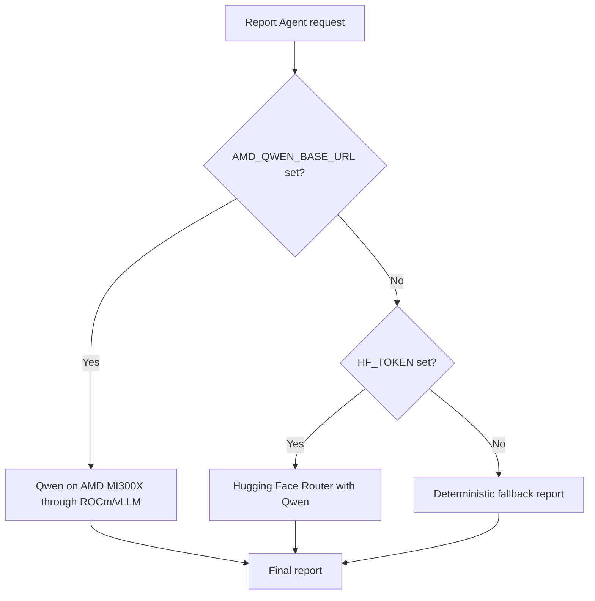
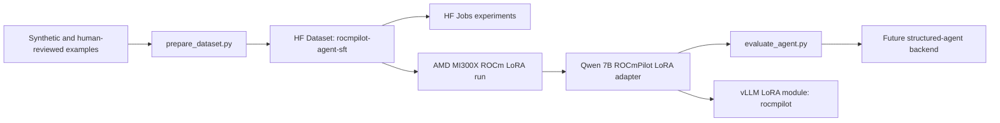
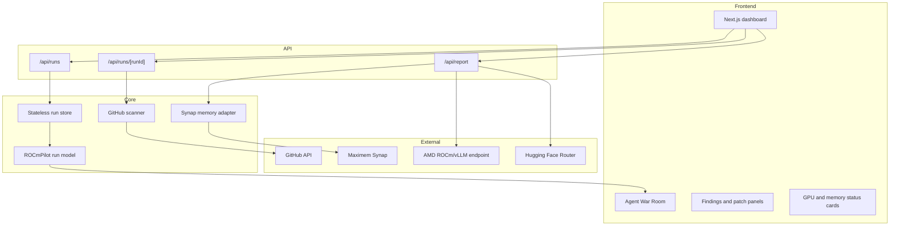
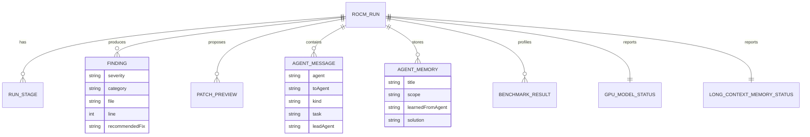
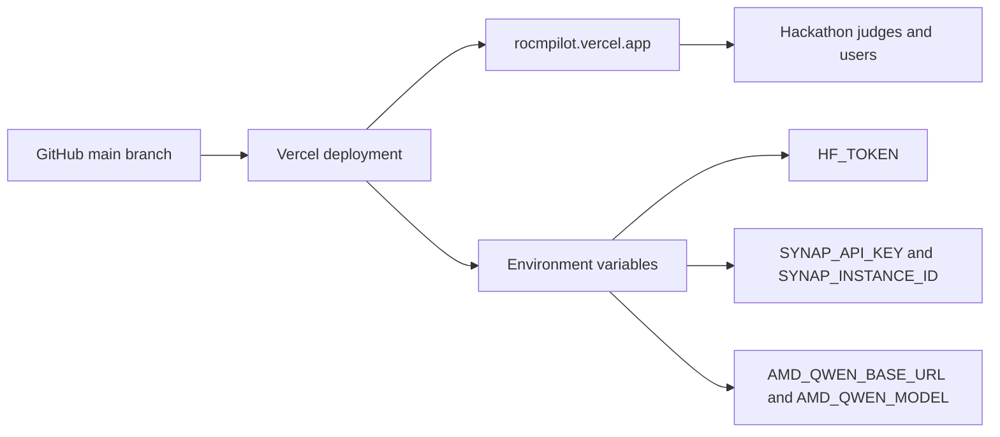
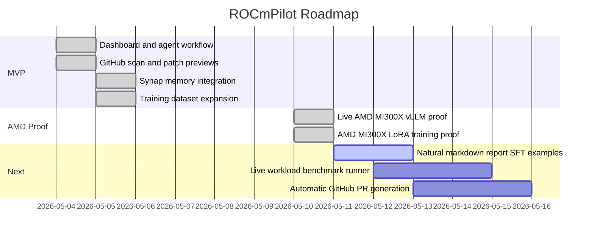

# ROCmPilot Technical Walkthrough


## Submission Links

| Artifact | Link |
| --- | --- |
| Live demo | [https://rocmpilot.vercel.app](https://rocmpilot.vercel.app) |
| Source code | [https://github.com/shivambhartiya/rocmpilot](https://github.com/shivambhartiya/rocmpilot) |
| Hugging Face Space | [https://shivam311-rocmpilot.hf.space](https://shivam311-rocmpilot.hf.space) |
| Training dataset | [https://huggingface.co/datasets/Shivam311/rocmpilot-agent-sft](https://huggingface.co/datasets/Shivam311/rocmpilot-agent-sft) |
| AMD-trained LoRA adapter | [https://huggingface.co/Shivam311/rocmpilot-agent-qwen25-coder-7b-lora-amd-mi300x-v1](https://huggingface.co/Shivam311/rocmpilot-agent-qwen25-coder-7b-lora-amd-mi300x-v1) |
| Technical walkthrough | [TECHNICAL_WALKTHROUGH.md](./TECHNICAL_WALKTHROUGH.md) |

## One-Line Pitch

ROCmPilot is a multi-agent developer tool that scans CUDA-first AI repositories and generates ROCm migration findings, patch previews, validation plans, reusable memory, downloadable migration kits, and a judge-ready technical/business report, with Qwen inference and LoRA training proven on AMD MI300X.

## Why ROCmPilot Matters

AI teams often want AMD GPU optionality, but real repositories quietly assume NVIDIA at many layers:

- Docker images such as `nvidia/cuda` or `nvcr.io/nvidia/pytorch`
- Python code with `torch.device("cuda")`, `.cuda()`, or `device_map="cuda"`
- dependency pins for `cu121`, `cu124`, `nvidia-cublas-cu12`, `flash-attn`, or `xformers`
- scripts using `nvidia-smi`, `CUDA_VISIBLE_DEVICES`, or `--gpus all`
- vLLM launch scripts that do not expose ROCm validation knobs
- benchmarks that report latency without backend, memory, tokens/sec, or command provenance

ROCmPilot converts that messy migration work into a structured agentic workflow. It does not pretend to automatically port every project. Instead, it gives developers a credible migration map, concrete patch previews, validation evidence, and a report they can hand to maintainers or infrastructure leaders.

## Product Overview



## User Flow

1. Open the ROCmPilot dashboard.
2. Select a sample workload or paste a public GitHub repository URL.
3. Start a run.
4. Watch the live agent timeline and Agent War Room.
5. Review findings, patch previews, logs, benchmark profile, and long-context memory status.
6. Read the generated final report.
7. Use the output as a migration plan or as the basis for a future PR.

## Agent System

ROCmPilot uses specialized agents, each responsible for a different migration concern.

| Agent | Responsibility | Output |
| --- | --- | --- |
| Repo Doctor Agent | Finds CUDA/NVIDIA assumptions across code, Docker, scripts, dependencies, and benchmarks. | Findings with severity, category, file, line, and fix. |
| Migration Planner Agent | Converts findings into ROCm-safe migration recommendations. | Patch previews and backend-aware migration steps. |
| Build Runner Agent | Challenges whether the plan can be validated. | Smoke-test commands, container checks, and proof boundaries. |
| Benchmark Agent | Separates live evidence from estimates. | AMD-readiness profile and measurement plan. |
| Memory Agent | Stores reusable decisions across runs. | Synap-backed long-context memory or local fallback memory. |
| Report Agent | Turns the run into a credible submission/report. | Final markdown report with technical and business value. |
| CUDA/ROCm Coach Agent | Answers user questions about CUDA, ROCm, PyTorch, vLLM, fallback behavior, and proof boundaries. | Practical developer guidance grounded in the current run. |
| Migration Kit Agent | Packages findings and patch previews into a downloadable handoff artifact. | Markdown migration kit with files, commands, and validation steps. |

## Agent War Room

The MVP is not just a set of isolated cards. Agents route messages to each other, ask questions, answer objections, and write shared memory.



## Long-Context Memory With Synap

ROCmPilot integrates Maximem Synap as the long-context memory layer. When configured, the Report Agent stores the whole agent discussion as an `ai-chat-conversation`, fetches relevant context, and injects it into report generation.

If Synap credentials or runtime setup are unavailable, ROCmPilot falls back to reconstructed local memory so the demo remains reliable.



### Memory Values Stored

| Memory Type | Example |
| --- | --- |
| Device resolution pattern | Use a single backend resolver instead of scattered `.cuda()` checks. |
| ROCm acceptance checks | Prove import, backend detection, vLLM health, and provenance logging. |
| Container split decision | Add `Dockerfile.rocm`; keep CUDA support separate. |
| Metric provenance rule | Label estimates until AMD SMI/vLLM logs exist. |
| Health-check rule | Replace `nvidia-smi` proof with `rocm-smi` or `amd-smi` proof on AMD. |

## Detection and Recommendation Logic

ROCmPilot scans public GitHub repositories using the GitHub API and focuses on files that usually control AI runtime portability.



### Current Detection Categories

| Category | Severity | Typical Evidence | Recommended Direction |
| --- | --- | --- | --- |
| Hardcoded CUDA device path | Critical | `.cuda()`, `torch.device("cuda")`, `device_map="cuda"` | Add a backend-aware resolver and log ROCm/CUDA/CPU provenance. |
| NVIDIA container/runtime assumption | High | `nvidia/cuda`, `nvcr.io`, `--gpus all` | Add ROCm runtime image/profile and keep CUDA optional. |
| CUDA-oriented dependency | High | `cu124`, `nvidia-cublas-cu12`, `flash-attn`, `xformers` | Split dependencies into backend-specific profiles. |
| vLLM defaults need AMD profile | Medium | vLLM launch without model length, tensor parallelism, or metrics | Add ROCm vLLM serve script with OpenAI-compatible endpoint settings. |
| Benchmark evidence incomplete | Medium | latency-only benchmark | Add tokens/sec, memory, backend, model id, command provenance, p95 latency. |
| NVIDIA monitoring command | Medium | `nvidia-smi` | Add `rocm-smi` or `amd-smi` evidence path. |
| CUDA extension build path | High | `.cu`, `CUDAExtension`, `CUDA_HOME` | Gate CUDA extension builds and document ROCm-safe alternatives. |
| Docker Compose NVIDIA reservation | High | `driver: nvidia`, `runtime: nvidia` | Add separate ROCm Compose profile. |

## Patch Preview Example

ROCmPilot does not currently mutate external repositories or open PRs automatically. Instead, it generates patch previews that are safe to review.

```diff
+import torch
+
+def resolve_device() -> tuple[str, str]:
+    if torch.cuda.is_available():
+        backend = "rocm" if getattr(torch.version, "hip", None) else "cuda"
+        return "cuda", backend
+    return "cpu", "cpu"
+
+DEVICE, GPU_BACKEND = resolve_device()
```

This pattern is important because PyTorch on ROCm still exposes GPU access through the `torch.cuda` API surface. The resolver records whether the backend is actually CUDA or HIP-backed ROCm.

## Model and Compute Strategy

ROCmPilot is a Track 1 agentic workflow project. The primary product is agent coordination around a real developer migration workflow, and AMD compute powers the model-serving and training proof behind that workflow.



### Backend Priority

1. AMD ROCm/vLLM endpoint via `AMD_QWEN_BASE_URL`
2. Hugging Face Router via `HF_TOKEN`
3. Static fallback report

This keeps the submission demo-safe while still using AMD compute when it is available. If the MI300X droplet is shut down, the app waits briefly, falls back to Hugging Face, and still completes the run.

## AMD MI300X Proof

ROCmPilot now has real AMD proof in two layers: inference and training.

### AMD Inference

We launched an AMD Developer Cloud MI300X instance with the ROCm/vLLM quick-start image and served Qwen through an OpenAI-compatible endpoint.

| Proof Item | Captured Result |
| --- | --- |
| GPU visibility | `rocm-smi` showed `AMD Instinct MI300X VF` |
| Runtime | ROCm quick-start container |
| Serving stack | vLLM `0.17.1+rocm700` |
| Report model | `Qwen/Qwen2.5-Coder-7B-Instruct` |
| Endpoint format | OpenAI-compatible `/v1/chat/completions` |
| Vercel source | `amd-vllm` when the droplet is online |

The live app was verified to return:

```text
source: amd-vllm
label: AMD GPU Model: Connected
model: Qwen/Qwen2.5-Coder-7B-Instruct
```

### AMD Training

We also trained a Qwen Coder LoRA adapter on AMD MI300X using ROCm PyTorch.

| Item | Value |
| --- | --- |
| Base model | `Qwen/Qwen2.5-Coder-7B-Instruct` |
| Output adapter | `Shivam311/rocmpilot-agent-qwen25-coder-7b-lora-amd-mi300x-v1` |
| Dataset | `Shivam311/rocmpilot-agent-sft` |
| Dataset size | 297 examples |
| Hardware | AMD MI300X |
| LoRA config | `r=32`, `alpha=64`, `dropout=0.05` |
| Training runtime | about 279 seconds |
| Train loss | about 0.497 |
| Final eval loss | about 0.0447 |
| Adapter size | about 323 MB |

During training, `rocm-smi` showed the MI300X actively working with high GPU utilization. The adapter was pushed to Hugging Face and then loaded back into vLLM as:

```text
model=rocmpilot
```

Direct inference against `model=rocmpilot` succeeded on the AMD endpoint. The public Vercel report panel currently stays on the base AMD-hosted Qwen model because the adapter is optimized for structured agent behavior and tends to emit schema-like report outputs. The next data revision will add more natural markdown report completions before switching the production report panel to the adapter.

## Training Path

The project includes a supervised fine-tuning path for polishing agent style, structured migration recommendations, and long-term task behavior.

| Artifact | Detail |
| --- | --- |
| Dataset repo | [Shivam311/rocmpilot-agent-sft](https://huggingface.co/datasets/Shivam311/rocmpilot-agent-sft) |
| Current seed size | 297 examples |
| Tasks | repo doctor, migration planner, patch planner, benchmark agent, report agent, memory agent, CUDA/ROCm coach, endpoint troubleshooter, migration kit, agent discussion |
| AMD-trained base model | `Qwen/Qwen2.5-Coder-7B-Instruct` |
| AMD-trained adapter | `Shivam311/rocmpilot-agent-qwen25-coder-7b-lora-amd-mi300x-v1` |
| Serving test | Adapter loaded into AMD vLLM as `rocmpilot` |



Training is supporting polish, not replacing the main product. The central submission claim remains the agentic developer workflow, with AMD compute proof for both serving and LoRA training.

## App Architecture



## Data Model



## Deployment Architecture



## Environment Variables

| Variable | Required for MVP | Purpose |
| --- | --- | --- |
| `HF_TOKEN` | Recommended | Enables Hugging Face Qwen report generation. |
| `HF_REPORT_MODEL` | Optional | Defaults to `Qwen/Qwen2.5-Coder-7B-Instruct`. |
| `GITHUB_TOKEN` | Optional | Raises GitHub API limits for public repo scans. |
| `SYNAP_INSTANCE_ID` | Optional | Targets the Synap memory instance. |
| `SYNAP_API_KEY` | Optional | Enables persistent long-context memory. |
| `SYNAP_BASE_URL` | Optional | Synap cloud endpoint override. |
| `SYNAP_CUSTOMER_ID` | Optional | Memory scope, defaults to `rocmpilot-hackathon`. |
| `SYNAP_USER_ID` | Optional | Agent fleet memory identity. |
| `AMD_QWEN_BASE_URL` | Optional | Enables AMD-hosted Qwen through ROCm/vLLM. |
| `AMD_QWEN_MODEL` | Optional | Current production value is `Qwen/Qwen2.5-Coder-7B-Instruct`; trained adapter can be served as `rocmpilot`. |
| `AMD_QWEN_API_KEY` | Optional | Bearer token for the vLLM endpoint when protected. |

## Demo Script

Use this script for a 2-3 minute project walkthrough.

1. Open [https://rocmpilot.vercel.app](https://rocmpilot.vercel.app).
2. Paste a CUDA-heavy public repo, for example `https://github.com/NVIDIA/cuda-samples` or `https://github.com/NVIDIA/Megatron-LM`.
3. Click `Scan Repo`.
4. Explain that Repo Doctor scans public files for CUDA/NVIDIA assumptions.
5. Point to the Agent War Room and show agents asking each other questions instead of acting independently.
6. Show Shared Memory and explain that decisions are reused later.
7. Open Migration Findings and Patch Previews.
8. Open the GPU model status card and explain the backend priority: AMD ROCm/vLLM when available, Hugging Face fallback when AMD is down, static fallback for reliability.
9. Open the Long-context memory card and explain Synap memory.
10. Show the final report and emphasize business value: faster AMD migration planning, reduced infra risk, and a clear path from audit to validation.

## What Is Fully Implemented Today

| Capability | Status |
| --- | --- |
| Next.js dashboard | Implemented |
| Public GitHub URL scan | Implemented |
| CUDA/NVIDIA findings | Implemented |
| Patch previews | Implemented |
| Agent War Room routed messages | Implemented |
| Shared run memory | Implemented |
| Synap memory adapter | Implemented with fallback |
| Hugging Face Qwen report generation | Implemented when `HF_TOKEN` is configured |
| Static fallback report | Implemented |
| Vercel deployment | Implemented |
| Training dataset | Implemented and published |
| CUDA/ROCm Coach Agent | Implemented |
| Migration Kit Agent | Implemented |
| AMD MI300X vLLM inference | Implemented and verified |
| AMD MI300X Qwen LoRA training | Implemented and verified |
| AMD-trained LoRA adapter | Implemented, published, and loaded into vLLM as `rocmpilot` |

## Honest Boundaries

| Capability | Current Boundary |
| --- | --- |
| Automatic PR creation | Not implemented yet. ROCmPilot generates patch previews and recommendations. |
| Live workload benchmark proof | Not yet run end-to-end against arbitrary user repos. Current benchmark cards are labeled static estimates unless live logs are captured. |
| Synap on every Vercel run | Integrated, but falls back if the Synap Python bridge cannot initialize in the serverless runtime. |
| Full repository mutation | Not performed by design in the MVP. Maintainers should review patch previews first. |
| Production report model | Uses base AMD-hosted Qwen for polished markdown. The AMD-trained adapter is currently better suited to structured agent outputs. |

## Business Value

ROCmPilot is useful for:

- AI startups that want AMD GPU optionality without manually auditing every codebase.
- Infrastructure teams evaluating whether an internal CUDA-first service can move to ROCm.
- Open-source maintainers who want clear, reviewable migration guidance.
- Cloud/GPU providers that need a repeatable readiness assessment workflow.

### Business Impact

| Problem | ROCmPilot Value |
| --- | --- |
| Migration audits are manual and slow. | Automated agentic scan and report. |
| CUDA assumptions hide across many files. | Multi-layer detection across Docker, Python, shell, dependencies, and benchmarks. |
| Teams overclaim hardware readiness. | Explicit separation of estimates, fallback, and live AMD proof. |
| Migration work is hard to hand off. | Patch previews and judge/infra-ready report. |
| Agents forget past decisions. | Synap long-context memory for reusable migration knowledge. |

## Roadmap



## AMD Serving And Training Commands

The AMD proof used an MI300X instance with a ROCm/vLLM quick-start container.

Base report model serving:

```bash
vllm serve Qwen/Qwen2.5-Coder-7B-Instruct \
  --host 0.0.0.0 \
  --port 8000 \
  --trust-remote-code \
  --max-model-len 8192 \
  --gpu-memory-utilization 0.90 \
  --api-key "$AMD_QWEN_API_KEY"
```

Serving the AMD-trained LoRA adapter:

```bash
vllm serve Qwen/Qwen2.5-Coder-7B-Instruct \
  --host 0.0.0.0 \
  --port 8000 \
  --trust-remote-code \
  --max-model-len 8192 \
  --gpu-memory-utilization 0.88 \
  --api-key "$AMD_QWEN_API_KEY" \
  --enable-lora \
  --max-lora-rank 32 \
  --lora-modules rocmpilot=Shivam311/rocmpilot-agent-qwen25-coder-7b-lora-amd-mi300x-v1
```

The app uses the same OpenAI-compatible endpoint:

```text
POST /v1/chat/completions
```

## Future AMD Expansion

The next AMD steps are:

1. Add more natural markdown report completions to the SFT dataset.
2. Promote the `rocmpilot` adapter from structured-agent backend to production report backend.
3. Run live workload benchmarks against real scanned repositories.
4. Add automatic GitHub pull request generation.
5. Test larger Qwen code models such as 14B/32B as optional high-power AMD mode.

## Why This Fits Track 1

ROCmPilot is not primarily a fine-tuning project and not primarily a multimodal project. It is a coordinated AI-agent workflow:

- multiple specialized agents
- routed agent-to-agent discussion
- lead-agent task ownership
- shared and persistent memory
- model-backed report generation
- real developer workflow around repository migration

That makes **AI Agents & Agentic Workflows** the best hackathon track.

## Closing Summary

ROCmPilot turns CUDA-to-ROCm migration from an unclear engineering chore into an agentic developer workflow. It scans real repositories, identifies migration blockers, proposes ROCm-ready patches, records reusable memory, and generates a technical/business report.

The MVP is reliable on Vercel, but it is no longer only a simulated AMD story: Qwen inference has run through ROCm/vLLM on AMD MI300X, and a Qwen Coder 7B LoRA adapter has been trained on AMD MI300X and loaded back into vLLM as `rocmpilot`. The current production report path uses the base AMD-hosted Qwen model for polished markdown, while the trained adapter becomes the next structured-agent backend after more report-style data is added.

That is the heart of ROCmPilot: a practical path from "this repo assumes CUDA" to "here is how we move, prove, remember, and scale it on AMD."
